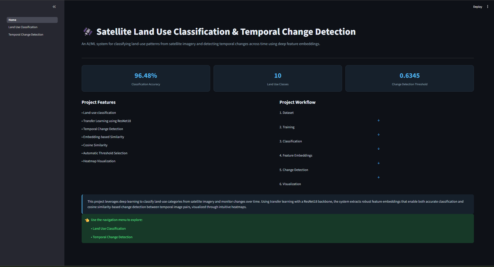
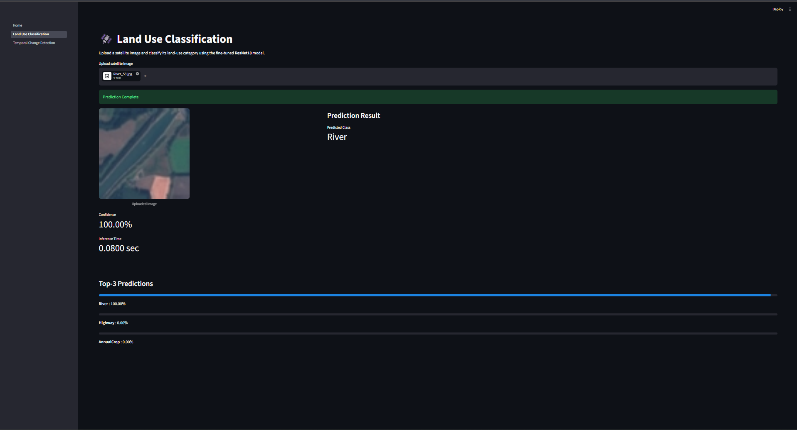
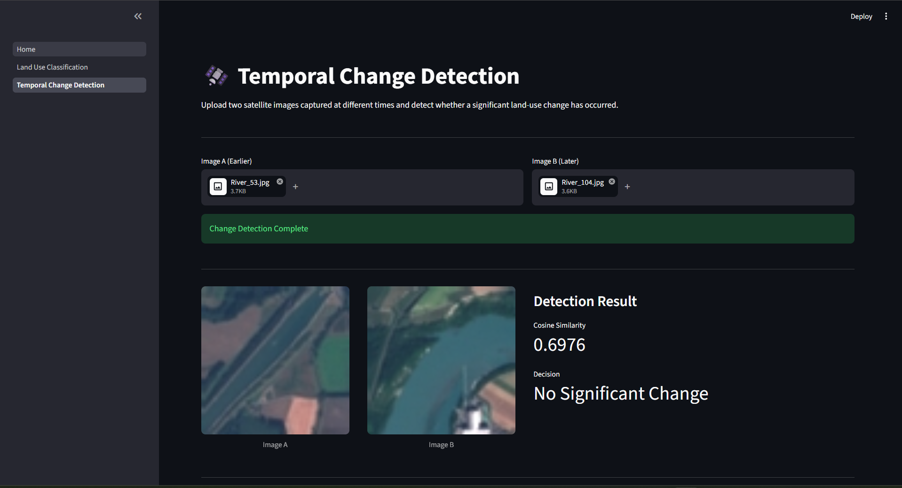
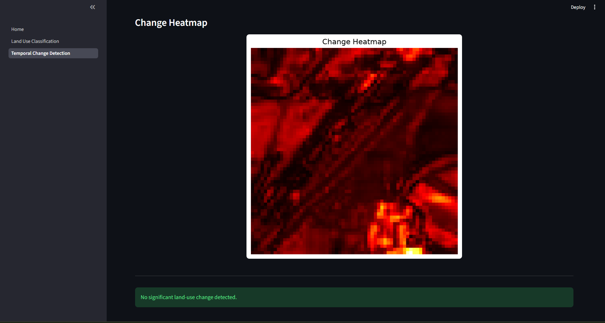

# 🛰️ Satellite Land Use Classification & Temporal Change Detection

An end-to-end Deep Learning application for **land-use classification** and **temporal change detection** using satellite imagery. The project leverages **Transfer Learning with ResNet18** to classify satellite images into 10 land-use categories and detects changes between images captured at different time periods using deep feature embeddings and cosine similarity.

<p align="center">


</p>

---

## 🚀 Live Demo

**Streamlit Application**

https://satellite-landuse-change-detector-8m7cn8irt4s46kv4zfowd6.streamlit.app/

---

## 📌 Project Overview

Satellite imagery has become an essential source of information for environmental monitoring, agriculture, urban planning, disaster management, and land-use analysis. Manually analyzing thousands of satellite images is both time-consuming and error-prone.

This project presents an end-to-end deep learning solution that automates two important computer vision tasks:

- **Land Use Classification** using a fine-tuned ResNet18 model.
- **Temporal Change Detection** using deep feature embeddings and cosine similarity.

The system first classifies satellite images into one of ten land-use categories from the EuroSAT dataset. It then compares two satellite images captured at different times by extracting high-level feature embeddings and measuring their similarity. If the similarity falls below a learned threshold, the system identifies the region as having undergone a significant land-use change.

The complete solution is deployed as an interactive Streamlit web application, allowing users to upload satellite images, perform inference in real time, and visualize detected changes through heatmaps.

---

## ✨ Key Features

- Land-use classification using Transfer Learning
- Fine-tuned ResNet18 backbone
- Classification across 10 EuroSAT land-use classes
- Deep feature embedding extraction
- Cosine similarity-based temporal change detection
- Automatically selected similarity threshold
- Pixel-wise change heatmap visualization
- Interactive Streamlit web interface
- Real-time inference
- Clean and modular project structure

---

## 🛠 Tech Stack

| Category | Technologies |
|-----------|--------------|
| Language | Python |
| Deep Learning | PyTorch, TorchVision |
| Image Processing | Pillow, OpenCV |
| Data Analysis | NumPy, Pandas |
| Visualization | Matplotlib |
| Web Framework | Streamlit |
| Dataset | EuroSAT |
| Version Control | Git, GitHub |

---

## 📂 Dataset

The project uses the **EuroSAT** dataset, one of the most widely used benchmark datasets for satellite image classification.

| Property | Value |
|----------|------:|
| Dataset | EuroSAT |
| Total Images | 27,000 |
| Number of Classes | 10 |
| Image Size | 64 × 64 RGB |

### Land Use Classes

- Annual Crop
- Forest
- Herbaceous Vegetation
- Highway
- Industrial
- Pasture
- Permanent Crop
- Residential
- River
- Sea/Lake

---

## 📈 Project Highlights

| Metric | Value |
|---------|------:|
| Classification Model | Fine-tuned ResNet18 |
| Classification Accuracy | **96.48%** |
| Similarity Metric | Cosine Similarity |
| Change Detection Threshold | **0.6345** |
| Deployment | Streamlit Cloud |

---

# ⚙️ Project Workflow

The complete pipeline consists of two independent computer vision tasks: **Land Use Classification** and **Temporal Change Detection**.

```text
                     Satellite Image
                            │
                            ▼
                  Image Preprocessing
          (Resize → Normalize → Tensor)
                            │
                            ▼
              Fine-tuned ResNet18 Model
                     ┌──────────────┐
                     │              │
                     ▼              ▼
          Land Use Classification   Feature Embeddings
                     │              │
                     ▼              ▼
          Predicted Land Class   Cosine Similarity
                                        │
                                        ▼
                           Temporal Change Detection
                                        │
                                        ▼
                              Change Heatmap
```

---

# 🧠 Model Architecture

The classification module is built using **Transfer Learning** with **ResNet18**. Instead of training a convolutional neural network from scratch, a pre-trained ResNet18 backbone is fine-tuned on the EuroSAT dataset. This approach provides faster convergence, better feature extraction, and improved classification accuracy.

The temporal change detection module reuses the learned visual representations from the same network. Instead of predicting a class, the classifier head is removed to extract **512-dimensional feature embeddings**. These embeddings are compared using **Cosine Similarity** to determine whether two satellite images represent the same land-use pattern or a significant change.

---

# 📊 Model Performance

| Metric | Value |
|---------|------:|
| Dataset | EuroSAT |
| Images | 27,000 |
| Classes | 10 |
| Backbone | ResNet18 |
| Transfer Learning | ✅ |
| Classification Accuracy | **96.48%** |
| Similarity Metric | Cosine Similarity |
| Change Threshold | **0.6345** |
| Deployment | Streamlit Cloud |

---

# 🖥️ Application Preview

## 🏠 Home Page

The landing page provides an overview of the project, model performance, supported features, and the complete workflow.



---

## 🛰️ Land Use Classification

Users can upload a satellite image and receive:

- Predicted land-use class
- Prediction confidence
- Top-3 predicted classes
- Inference time



---

## 🌍 Temporal Change Detection

The application compares two satellite images captured at different time periods and determines whether a significant land-use change has occurred.

The page displays:

- Cosine similarity score
- Final decision
- Pixel-wise change heatmap



---

## 🔥 Change Heatmap

A pixel-wise heatmap highlights regions where visual differences exist between two satellite images.

This visualization helps users quickly identify areas with the highest amount of change.



---

# 📁 Project Structure

```text
satellite-landuse-change-detector
│
├── app/
│   ├── Home.py
│   ├── pages/
│   └── utils/
│
├── assets/
│   └── screenshots/
│
├── data/
│
├── models/
│   └── checkpoints/
│
├── notebooks/
│
├── outputs/
│
├── src/
│   ├── data/
│   ├── inference/
│   ├── models/
│   ├── training/
│   └── visualization/
│
├── requirements.txt
└── README.md
```

---

# 🚀 Getting Started

Follow the steps below to set up and run the project on your local machine.

## Prerequisites

Make sure the following software is installed:

- Python 3.10 or later
- Git
- pip
- Virtual Environment (recommended)

---

## Clone the Repository

```bash
git clone https://github.com/akshitsharma009/satellite-landuse-change-detector.git

cd satellite-landuse-change-detector
```

---

## Create a Virtual Environment

### Windows

```bash
python -m venv .venv

.venv\Scripts\activate
```

### Linux / macOS

```bash
python3 -m venv .venv

source .venv/bin/activate
```

---

## Install Dependencies

```bash
pip install -r requirements.txt
```

---

## Download the Dataset

This project uses the **EuroSAT** dataset.

Place the dataset inside the following directory:

```text
data/
└── raw/
    └── EuroSAT/
```

> **Note:** The dataset is not included in this repository because of its size.

---

## Download the Trained Model

The fine-tuned ResNet18 checkpoint is included in this repository.

```text
models/
└── checkpoints/
    └── resnet18_finetuned.pth
```

No additional training is required to run inference.

---

# ▶️ Running the Streamlit Application

Start the application using:

```bash
streamlit run app/Home.py
```

Once the server starts, open the displayed local URL in your browser.

---

# 📖 How to Use

## Land Use Classification

1. Open the **Land Use Classification** page.
2. Upload a satellite image.
3. The model predicts:
   - Land-use category
   - Confidence score
   - Top-3 predictions
   - Inference time

---

## Temporal Change Detection

1. Open the **Temporal Change Detection** page.
2. Upload two satellite images captured at different times.
3. The application:
   - Extracts feature embeddings
   - Computes cosine similarity
   - Determines whether a significant change occurred
   - Generates a change heatmap

---

# 📂 Important Project Files

| File / Folder | Description |
|---------------|-------------|
| `app/` | Streamlit web application |
| `src/models/` | Deep learning models |
| `src/inference/` | Inference and embedding utilities |
| `src/training/` | Training pipeline |
| `src/visualization/` | Heatmap generation and plots |
| `models/checkpoints/` | Trained model checkpoints |
| `notebooks/` | Experiments and model development |
| `outputs/` | Generated metrics and visualizations |

---

# 💡 Key Highlights

- End-to-end Deep Learning project
- Fine-tuned ResNet18 model
- Embedding-based change detection
- Real-time inference
- Streamlit deployment
- Modular and maintainable project structure
- Portfolio-ready implementation

---

# 🔍 Technical Implementation

The project is organized into modular components to ensure readability, maintainability, and scalability.

### Data Pipeline

- Image loading and preprocessing
- Data augmentation for training
- Normalization using ImageNet statistics
- PyTorch DataLoader for efficient batching

### Classification Module

- Transfer Learning using ResNet18
- Fine-tuned classifier head for EuroSAT
- Real-time inference with confidence scores
- Top-3 prediction support

### Change Detection Module

- Feature extraction using the trained ResNet18 backbone
- Generation of 512-dimensional feature embeddings
- Cosine similarity calculation between image pairs
- Threshold-based decision making
- Pixel-wise heatmap visualization

### Web Application

The Streamlit application provides two independent modules:

- **Land Use Classification**
- **Temporal Change Detection**

The interface is designed to provide real-time predictions with a simple and intuitive workflow.

---

# 📊 Results Summary

| Component | Status |
|-----------|:------:|
| Dataset Exploration | ✅ |
| Data Preprocessing | ✅ |
| Baseline CNN | ✅ |
| Transfer Learning (ResNet18) | ✅ |
| Model Evaluation | ✅ |
| Land Use Classification | ✅ |
| Feature Embedding Extraction | ✅ |
| Cosine Similarity | ✅ |
| Temporal Change Detection | ✅ |
| Heatmap Visualization | ✅ |
| Streamlit Deployment | ✅ |

---

# 🚧 Current Limitations

Although the project performs well on the EuroSAT dataset, there are several areas for future enhancement.

- Designed and evaluated on the EuroSAT dataset only.
- Change detection is based on feature similarity rather than pixel-level semantic segmentation.
- Images are processed independently without considering temporal sequences.
- The application currently supports single-image classification and two-image comparison.

These limitations provide opportunities for extending the project in future work.

---

# 🚀 Future Improvements

Potential directions for extending this project include:

- Support additional satellite datasets (e.g., Sentinel-2, Landsat).
- Integrate Vision Transformer (ViT) based models.
- Implement semantic segmentation for precise change localization.
- Support multi-temporal satellite image analysis.
- Add model explainability using Grad-CAM.
- Deploy using Docker and cloud infrastructure.
- Build a REST API using FastAPI.

---

# 📚 Learning Outcomes

This project provided practical experience in:

- Transfer Learning with PyTorch
- Building modular deep learning pipelines
- Satellite image classification
- Feature embedding extraction
- Similarity-based change detection
- Model deployment with Streamlit
- Version control using Git and GitHub
- End-to-end machine learning project development

---

# 🙏 Acknowledgements

This project uses the following open-source resources:

- EuroSAT Dataset
- PyTorch
- TorchVision
- Streamlit
- OpenCV
- NumPy
- Matplotlib

Special thanks to the open-source community for providing tools and resources that made this project possible.

---

# 👨‍💻 Author

**Akshit Sharma**

B.Tech – Computer Science Engineering (AI)

### Connect with Me

- GitHub: https://github.com/akshitsharma009
- LinkedIn: *(Add your LinkedIn profile here)*

---

## ⭐ Support

If you found this project useful, consider giving it a **Star** on GitHub.

It helps increase the visibility of the project and motivates future improvements.

---

## 📄 License

This project is released under the **MIT License**.

Feel free to use, modify, and build upon it for learning and educational purposes.